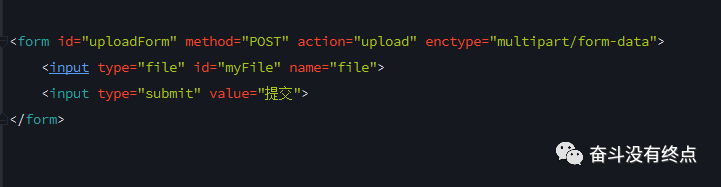
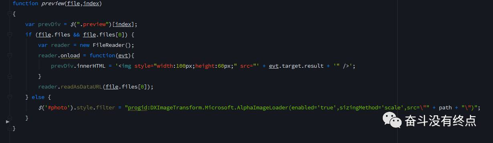

# 文件上传

## 0.引言

&emsp;&emsp;文件上传，貌似不是很常见的需求，不过最近公司的多个项目都用到了图片上传。顺便把上文件传的的知识总结了一下，欢迎各路大神指点拍砖。

## 1  FileUpload对象

&emsp;&emsp;最核心元素就是这个HTML DOM的FileUpload对象了

&emsp;&emsp;网页上传文件，就是运用HTML DOM的FileUpload的对象。这句话看着不好理解，其实这句话就是<input type="file">，在我们的页面上它每出现一次，就会创建一个FileUpload对象。在页面上的表现就是这个鬼样子。

&emsp;&emsp;一般我们会采用表单提交的方式来上传文件，就是input标签结合form标签来实现，设置form标签的action为服务器的地址url，点击submit或通过JS调用form的submit()方法实现简单的上传。

&emsp;&emsp;虽然这样能够实现简单的代码上传，但是一个页面不可能只是让你上传一张图片 或者文件。你如果这样写代码，估计老大能把你骂死。这样的上传文件会刷新页面，装逼程序猿现在都是无刷新上传文件。

## 2.无刷新上传

&emsp;&emsp;——XMLHttpRequest

&emsp;&emsp;新版浏览器和旧版浏览器的XMLHttpRequest对比(这里就不再多说)
下面上代码

&emsp;&emsp;这里基本上已经基本上能够完成了基本的图片上功能了。
   
&emsp;&emsp;什么你要上传进度，给上传搞个进度条。没问题

## 3.上传进度

&emsp;&emsp;这里我们就要用到XHR对象的另一个属性了upload。返回的XMLHttpRequestUpload对象有以下方法。onloadstart(),onprogress(),onabort(),onerror(),onload(),ontimeout(),onloadend()。其中onprogress(event)事件回调方法中有我们需要的上传进度，event对象里面有两个重要的属性event.loaded和event.total，他们分别代表当前上传的字节数和文件的总字节数。那么我们可以计算出当前上传的百分比。

&emsp;&emsp;现在文件上传的百分比已经得到了，把这个值放在页面上就可以了。如果项目不需要兼容老版本浏览器，可用H5提供的<progress id="myProgress" value="50" max="100"></progress>，其中value的值就是我们之前计算的percentComplete。如果要兼容老版本的浏览器我们可以对progress的样式统一调整，做到优雅降级。

&emsp;&emsp;项目中调试进度条的时候发现进度条以迅雷不及掩耳响铃铛之势达到了100%。wtf，这怎么知道进度条是否写的对不对。文件太小，本地网络太好。最后用chrome把网络调成了2G，嗯 进度条没问题。因为xhr.upload.onprogress在上传阶段每50ms触发一次。所以小文件网络环境好的情况下就会直接100%。

## 4.图片回显

&emsp;&emsp;你以为项目完成了？No，老大又说了搞个图片上传预览。后台给url吗(大家都知道把url直接给img的src这是最简单的)？不给。wtf心中一万只草泥马奔腾而过。还好老子会用fileReader。上代码

&emsp;&emsp;IE9及以下不支持fileReader，只好用IE的滤镜。

&emsp;&emsp;多图片上传这里就不在多说了，只要在input标签里添加multiple就可以了。感兴趣的可以研究一下。